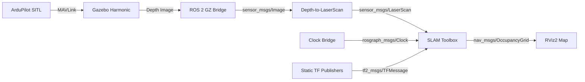

# 🛡️ Stealth Infiltration — GPS-Denied Autonomous Navigation

> Real-time SLAM-based mapping and navigation for autonomous UAV reconnaissance in GPS-denied environments.


## 🎯 Mission Objective

Deploy an autonomous quadrotor into an unknown indoor environment (warehouse) and generate a real-time occupancy grid map using **depth camera fusion** and **SLAM (Simultaneous Localization and Mapping)** — without any GPS signal.

This project demonstrates capabilities critical to **defense reconnaissance**, **search and rescue**, and **industrial inspection** operations.

## 🏗️ System Architecture



## 🔧 Technology Stack

| Component | Technology | Version |
|---|---|---|
| **Middleware** | ROS 2 Jazzy Jalisco | 2024 LTS |
| **Simulator** | Gazebo Harmonic | Latest |
| **Flight Controller** | ArduPilot SITL | ArduCopter |
| **SLAM Engine** | SLAM Toolbox | Async Online |
| **Sensor Fusion** | depthimage_to_laserscan | ROS 2 |
| **Visualization** | RViz2 | Jazzy |
| **OS** | Ubuntu 24.04 (WSL2) | Noble Numbat |
| **GPU** | NVIDIA RTX 3050 | CUDA via D3D12 |

## 📊 Results

### Occupancy Grid Map (106 x 124 cells @ 0.05m resolution)

The SLAM system successfully generated a real-time occupancy grid map of the warehouse environment:

- **White regions**: Confirmed free space (safe for navigation)
- **Gray regions**: Unknown/unexplored territory
- **Dark regions**: Detected obstacles and walls
- **Resolution**: 5cm per cell
- **Update Rate**: ~20 Hz laser scan input

### Sensor Pipeline Performance

| Metric | Value |
|---|---|
| Depth Camera FPS | ~30 Hz |
| LaserScan Rate | ~20 Hz |
| Map Resolution | 0.05 m/cell |
| Map Dimensions | 106 x 124 cells |
| Real-Time Factor | ~45% |

## 🚀 Quick Start

### Prerequisites

```bash
# ROS 2 Jazzy
sudo apt install ros-jazzy-desktop

# SLAM and Sensor Packages
sudo apt install ros-jazzy-slam-toolbox ros-jazzy-depthimage-to-laserscan

# Gazebo Harmonic
sudo apt install ros-jazzy-ros-gz

# ArduPilot SITL
git clone https://github.com/ArduPilot/ardupilot.git ~/ardupilot
cd ~/ardupilot && git submodule update --init --recursive
```

### Launch the Mission

**Terminal 1 — Simulation Environment:**
```bash
export GZ_SIM_RESOURCE_PATH=$HOME/ardupilot_gazebo/models:$HOME/ardupilot_gazebo/worlds
gz sim -v 4 iris_warehouse.sdf
```

**Terminal 2 — Flight Controller:**
```bash
cd ~/ardupilot/ArduCopter
python3 ../Tools/autotest/sim_vehicle.py -v ArduCopter -f gazebo-iris --console
```

**Terminal 3 — Sensor Bridges and TF:**
```bash
ros2 launch launch/stealth_bridges.py
```

**Terminal 4 — SLAM:**
```bash
ros2 launch slam_toolbox online_async_launch.py use_sim_time:=true
```

**Terminal 5 — Visualization:**
```bash
rviz2 --ros-args -p use_sim_time:=true
```

### Flight Commands (in MAVProxy console)
```
mode guided
arm throttle
takeoff 5
```

## 📁 Project Structure

```
stealth_infiltration/
├── launch/
│   └── stealth_bridges.py      # ROS 2 bridge and TF launch file
├── config/
│   └── slam_view.rviz          # RViz2 saved configuration
├── results/
│   └── warehouse_map.*         # Generated SLAM map files
├── docs/
│   └── slam_map_result.png     # SLAM visualization screenshot
└── README.md
```

## 🎖️ Defense and Aerospace Applications

This system architecture directly maps to real-world defense scenarios:

- **DRDO UAV Programs**: Indoor reconnaissance without GPS
- **HAL Rotary Wing**: Autonomous inspection in hangars
- **Search and Rescue**: Mapping collapsed structures
- **Industrial**: Warehouse inventory and inspection drones

## 👨‍✈️ Author

**Yogesh E S**
Aeronautical Engineering | Drone Autonomy and GNC Systems

[](https://github.com/yogesh031020)

---

*Built with ROS 2 Jazzy | Gazebo Harmonic | ArduPilot SITL | SLAM Toolbox*
